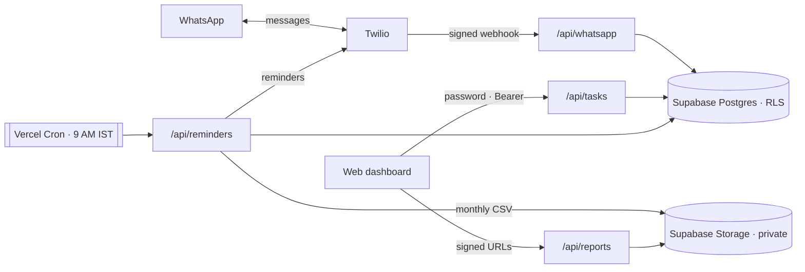

# Time Tracker

**A WhatsApp-native task manager.** Text it like you'd text a person — it files, schedules, reminds you, and archives the month. No app to open.


🔗 **Live demo:** [task-tracker-one-eta.vercel.app](https://task-tracker-one-eta.vercel.app) — password-gated personal instance, so the dashboard will ask for a passcode.

<p align="center">
  
  &nbsp;
  
</p>

---

## Why

Every to-do app I've tried has died the same way: I stopped opening it. The app itself becomes a chore — one more place to go, one more thing to maintain — so eventually you don't, and you're back to a mental list and a low hum of dread.

This one lives in the app I never close. You text a WhatsApp number in plain language and it handles the parsing, scheduling, and reminders; a web dashboard is there when you want the full view. The best tool removes a step instead of adding one.

## What it does

- **Add tasks by texting** a WhatsApp number in natural language — no menus, no forms.
- **Urgent flags, due dates, and time-based reminders**, all parsed from the message.
- **"Today" tasks auto-expire** once the day passes; **scheduled tasks** stay until you close them.
- **A daily 9 AM reminder** for anything due that day.
- **A web dashboard** to filter by today / scheduled / urgent / overdue / done, mark complete, or delete.
- **Automatic monthly archive** — last month's tasks are exported to CSV and downloadable from the dashboard, then cleared from the live list.

## WhatsApp commands

| Message | Result |
| --- | --- |
| `Today: Buy milk` | Task for today (cleared automatically once the day passes) |
| `Today 3pm: Call doctor` | Today, with a 3 PM time |
| `14/05/26: Submit report` | Scheduled for that date |
| `Urgent: Fix bug` | Urgent task for today |
| `Urgent 14/05/26: Big deadline` | Urgent **and** scheduled |
| `list` &nbsp;/&nbsp; `today` | Today's open tasks |
| `all` | Every open task, with dates |
| `urgent` | Urgent tasks only |
| `done 2` | Mark task #2 complete |
| `delete 3` | Remove task #3 |
| `help` | Show the command list |

## How it works

The whole thing is a handful of stateless Vercel functions over a Supabase database. Nothing runs on a server you have to babysit.



- **`/api/whatsapp`** receives Twilio's webhook, parses the message grammar, performs the action, and replies with TwiML.
- **`/api/tasks`** is a password-gated CRUD proxy the dashboard talks to — the browser never sees the database key.
- **`/api/reminders`** is the daily cron: it sends reminders for anything due today, deletes expired "today" tasks, and on the 1st of the month exports the previous month to CSV before purging it.
- **`/api/reports`** lists the archived CSVs as short-lived signed URLs.

## Security

The database is locked down and every entry point is authenticated — the service key never leaves the server.

- **Webhook verification.** Inbound WhatsApp requests are checked against Twilio's `X-Twilio-Signature` (HMAC-SHA1, constant-time comparison, fails closed). Forged or unsigned requests get a `403`.
- **Row Level Security.** The `tasks` table has RLS enabled with *no* anon/authenticated policies, so the public key can't read or write it at all. All access goes server-side via the `service_role` key, which bypasses RLS and is never exposed to the client.
- **Password-gated API.** The dashboard authenticates to the API with a bearer token, compared in constant time. Both the CRUD and reports endpoints refuse to run if the secret isn't configured.
- **Secret-gated cron.** The daily job is protected by a separate `CRON_SECRET` and won't execute if it's unset.
- **Private archives.** Monthly CSVs live in a private Storage bucket and are only ever handed out as short-lived signed URLs — nothing is publicly listable.
- **Input validation.** The CRUD proxy whitelists writable fields and validates every one (type checks, UUID/date/time regexes, length caps) before it reaches the database.

## Tech stack

- **Runtime:** Node.js (≥ 18) serverless functions on **Vercel**
- **Database & storage:** **Supabase** (Postgres + Storage)
- **Messaging:** **Twilio** WhatsApp Business API
- **Front end:** vanilla HTML / CSS / JS — an installable PWA
- **Scheduling:** Vercel Cron

## Project structure

```
.
├── api/
│   ├── whatsapp.js    # Twilio webhook — parses messages, writes via the service key
│   ├── tasks.js       # password-gated CRUD proxy for the dashboard
│   ├── reminders.js   # daily cron — reminders, cleanup, monthly CSV export
│   └── reports.js     # lists archived CSVs as short-lived signed URLs
├── public/
│   ├── index.html     # the dashboard (installable PWA)
│   └── manifest.json
├── supabase.sql       # tasks table + RLS lockdown
├── vercel.json        # cron schedule
└── package.json
```

## Running it yourself

### 1. Supabase

Create a project, then run [`supabase.sql`](./supabase.sql) in the SQL Editor. It creates the `tasks` table, enables RLS, and removes any wide-open policy. In **Storage**, create a bucket named `reports` and set it to **Private**.

### 2. Twilio WhatsApp

Set up the [Twilio WhatsApp sender](https://www.twilio.com/docs/whatsapp) (the sandbox works for testing). Note your Account SID, Auth Token, and WhatsApp number.

### 3. Environment variables

Set these in the Vercel project:

| Variable | Purpose |
| --- | --- |
| `SUPABASE_URL` | Your Supabase project URL |
| `SUPABASE_SERVICE_KEY` | The `service_role` key — server-side only, bypasses RLS |
| `APP_SECRET` | Password the dashboard uses to authenticate to `/api/*` |
| `TWILIO_ACCOUNT_SID` | Twilio Account SID |
| `TWILIO_AUTH_TOKEN` | Twilio Auth Token — also verifies inbound webhook signatures |
| `TWILIO_WHATSAPP_NUMBER` | Twilio sender, e.g. `whatsapp:+14155238886` |
| `YOUR_WHATSAPP_NUMBER` | Your number, where reminders are sent, e.g. `whatsapp:+91XXXXXXXXXX` |
| `CRON_SECRET` | Protects the `/api/reminders` cron endpoint |

### 4. Deploy to Vercel

Import the repo into Vercel and deploy. [`vercel.json`](./vercel.json) registers the daily cron (`30 3 * * *` UTC ≈ 9 AM IST).

### 5. Point the webhook

In the Twilio console, set the WhatsApp **"When a message comes in"** webhook to:

```
https://<your-deployment>.vercel.app/api/whatsapp
```

Text `help` to your WhatsApp number and you're live.

## Notes

Built as a **single-user personal tool** by design — one WhatsApp number, one password-gated dashboard. That keeps the auth model simple: there are no user accounts, just a locked-down database and authenticated endpoints.

## License

Not yet licensed. Add a `LICENSE` file (MIT is a good default) if you'd like others to reuse the code.
